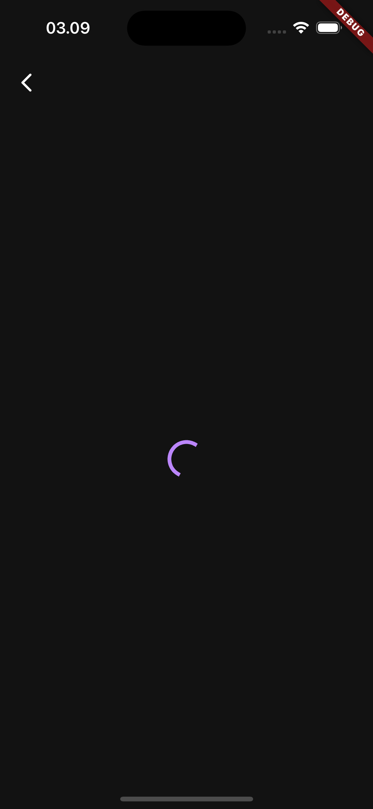

# flutter_newsapi


### Flutter Version
```
Flutter 3.19.1 • channel stable • https://github.com/flutter/flutter.git
Framework • revision abb292a07e (3 months ago) • 2024-02-20 14:35:05 -0800
Engine • revision 04817c99c9
Tools • Dart 3.3.0 • DevTools 2.31.1
```

### Setup
- Create `.env` file based on `.env.example` file in root directory.
- Run `flutter pub run build_runner watch --delete-conflicting-outputs` in terminal.
- Run project with this command `flutter run`.


### Screenshot
[](./screenshoot/1.png)
[](./screenshoot/2.png)
[](./screenshoot/3.png)

